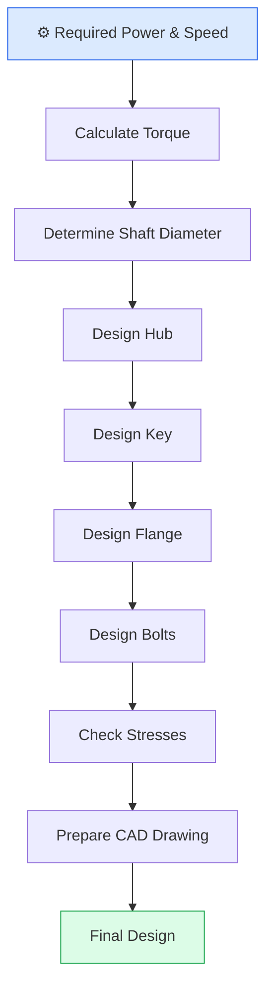
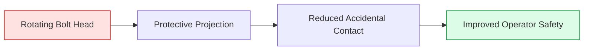
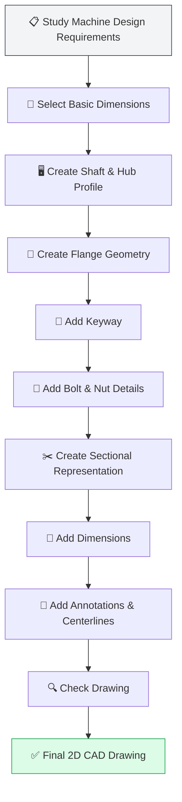

# ⚙️ Protected Flange Coupling — 2D CAD Design

> **A detailed 2D CAD design and sectional representation of a Protected Flange Coupling developed using AutoCAD, based on Machine Design principles.**

<p align="center">

**📐 Mechanical Design • 🏗️ Machine Design • 🔩 Flange Coupling • 💻 AutoCAD**

</p>

---

## 📌 Overview

This project presents the **2D CAD design of a Protected Flange Coupling** used for connecting two coaxial shafts and transmitting mechanical power from one shaft to another.

The coupling consists of two identical or mating **flanged hubs** mounted on the ends of two shafts. The hubs are connected using **bolts and nuts**, while keys provide a positive connection between the shafts and hubs.

The project was created in **AutoCAD** with detailed sectional views, dimensions, centerlines, hatching, keyway representation, and separate component details.

The design demonstrates the application of concepts from **Machine Design, Engineering Drawing, CAD Modelling, and Mechanical Power Transmission**.

---

## 🎯 Project Objectives

* Design a **Protected Flange Coupling** using AutoCAD.
* Understand the construction and working principle of flange couplings.
* Represent mechanical components using proper **2D engineering drawing conventions**.
* Apply dimensions, centerlines, sectional hatching, and annotations.
* Understand the function of **flanges, hubs, keys, bolts, nuts, and shafts**.
* Develop practical CAD skills applicable to mechanical engineering design.
* Create a professional engineering drawing suitable for a mechanical design portfolio.

---

## 🔩 What is a Flange Coupling?

A **flange coupling** is a rigid mechanical coupling used to connect two shafts in the same line and transmit torque between them.

Each shaft is fitted into a hub containing a **keyway**. The hubs have flanges that are joined together using bolts and nuts.

A **Protected Flange Coupling** is a modified flange coupling in which the bolt heads and nuts are enclosed by protective projections around the flange. This improves safety by reducing the possibility of accidental contact with rotating fasteners.

---

## 🛡️ Why is it Called "Protected" Flange Coupling?

In an ordinary flange coupling, the bolt heads and nuts may project outside the flange.

In a protected flange coupling, protective projections are provided around the flange so that the rotating **bolt heads and nuts are enclosed**.

### Main advantages

* 🛡️ Improved operator safety
* 🔩 Protection of bolts and nuts
* ⚙️ Compact and rigid construction
* 🔄 Reliable torque transmission
* 🏭 Suitable for industrial machinery

---

# 🧩 Main Components

| Component         | Material       | Function                                         |
| ----------------- | -------------- | ------------------------------------------------ |
| Flange 1          | Cast Iron (CI) | Connects the first shaft                         |
| Flange 2          | Cast Iron (CI) | Connects the second shaft                        |
| Hub               | Cast Iron (CI) | Provides connection between shaft and flange     |
| Shaft             | Steel          | Transmits torque                                 |
| Key               | Steel          | Prevents relative rotation between shaft and hub |
| Bolt              | Steel          | Connects the two flanges                         |
| Nut               | Steel          | Secures the bolts                                |
| Protective Flange | Cast Iron (CI) | Protects bolt and nut assembly                   |

---

# ⚙️ Working Principle

The working of the coupling can be understood through the following sequence:

**Driving Shaft → Key → Hub → Flange → Bolted Joint → Flange → Hub → Key → Driven Shaft**

The driving shaft rotates the first hub through the key. The hub transfers torque to the flange. The two flanges are rigidly connected using bolts and nuts, allowing torque to be transmitted to the second flange.

The second flange transfers the torque to its hub and finally to the driven shaft through the second key.

---

# 🔄 Power Transmission Flow


---

# 🏗️ Construction of Protected Flange Coupling

The coupling consists mainly of two flanged hubs mounted on the ends of two shafts.

Each hub is connected to its respective shaft using a **key**. The two flanges are brought together and connected using several bolts and nuts.

The protective arrangement around the flange covers the projecting bolt heads and nuts.

The coupling is generally used where the shafts are properly aligned and a **rigid connection** is required.

---

# 🧠 Design Concept

The basic design considerations for a flange coupling include:

### 1. Shaft

The shaft carries the transmitted torque and is generally made from steel.

The shaft diameter is selected based on the required torque, allowable shear stress, and strength requirements.

### 2. Hub

The hub provides the connection between the shaft and flange.

It contains a bore corresponding to the shaft diameter and a keyway for torque transmission.

### 3. Flange

The flange connects the two hubs and provides the mounting region for the bolts.

The flange must have sufficient thickness and diameter to withstand the transmitted torque and stresses.

### 4. Key

The key is fitted between the shaft and hub.

Its main purpose is to prevent relative rotational movement and transmit torque from the shaft to the hub.

### 5. Bolts and Nuts

Bolts and nuts join the two flanges together.

They provide the required clamping force and maintain the rigid connection between the two coupling halves.

### 6. Protection

The protective flange surrounds the bolt heads and nuts, reducing the risk of accidental contact with rotating components.

---

# 📐 CAD Drawing Features

The AutoCAD drawing contains the following engineering drawing features:

* 📏 Linear dimensions
* ⭕ Diameter dimensions
* ➖ Center lines
* 🪚 Sectional hatching
* 🔑 Keyway representation
* 🔩 Bolt and nut detail
* 📐 Taper representation
* 🏗️ Flange and hub profiles
* 📝 Component annotations
* 📊 Detailed sectional representation

---

# 🖥️ AutoCAD Drawing

## 📸 Final 2D CAD Design

The following screenshot shows the completed Protected Flange Coupling drawing developed in AutoCAD.

<p align="center">


</p>

### Drawing includes

**Left:** Flange 1 sectional representation
**Center:** Flange 2 sectional representation
**Upper Right:** Steel key detail
**Lower Right:** Steel bolt and nut detail

The drawing also shows the relevant dimensions, keyway, taper, centerlines, and sectional hatching.

---

# 📊 Drawing Interpretation

The drawing represents the coupling using a **sectional view** so that the internal construction can be clearly understood.

The hatched areas represent the material cut by the sectional plane.

The centerline represents the axis of rotation of the shaft and coupling.

The keyway is shown on the hub/shaft connection, while the bolt and nut are represented separately to clearly communicate the fastening arrangement.

---

# 🔧 Material Selection

### Flanges — Cast Iron

Cast iron is commonly used for flange bodies because of its:

* Good compressive strength
* Good machinability
* Good vibration-damping capability
* Relatively low cost
* Suitable casting characteristics

### Bolts and Nuts — Steel

Steel is preferred for bolts and nuts because of its:

* High tensile strength
* Good toughness
* Ability to withstand clamping loads
* Reliable performance under mechanical loading

### Key — Steel

Steel keys are used because they must withstand **shear and crushing stresses** during torque transmission.

---

# 📐 Important Design Considerations

A flange coupling should be designed by considering:



The major strength checks normally include:

* Shaft shear stress
* Key shear stress
* Key crushing stress
* Bolt shear stress
* Flange shear stress
* Flange bending stress
* Hub strength
* Torsional strength

---

# 🧮 Basic Mechanical Design Theory

## Torque Transmission

The torque transmitted by a shaft can be expressed as:

[
T = \frac{9550P}{N}
]

where:

* (T) = Torque in N·m
* (P) = Power in kW
* (N) = Speed in rpm

For shaft design, the torsion equation is:

[
T = \frac{\pi}{16}\tau d^3
]

where:

* (T) = Torque
* (\tau) = Allowable shear stress
* (d) = Shaft diameter

These equations are useful for determining the required shaft size based on the transmitted power and allowable stress.

---

# 🔑 Key Design Theory

The key connects the shaft and hub and transmits torque between them.

The key should be checked for:

### Shear Failure

[
T = \tau_k \frac{bLd}{2}
]

where:

* (b) = key width
* (L) = key length
* (d) = shaft diameter
* (\tau_k) = allowable shear stress

### Crushing Failure

The key should also be checked against crushing stress between the key, shaft, and hub.

Therefore, the key must have sufficient width, thickness, and length to safely transmit the required torque.

---

# 🔩 Bolt Design Theory

The bolts are used to clamp the two flanges together.

Depending on the design and loading condition, bolts may be checked for:

* Shear stress
* Tensile stress
* Bearing stress
* Fatigue loading
* Preload requirements

The bolt circle diameter and number of bolts are selected to provide sufficient torque transmission and structural rigidity.

---

# 🛡️ Protected Coupling Safety

One of the main advantages of this coupling is the protection provided around the rotating fasteners.



The protective arrangement is especially useful in industrial environments where exposed rotating fasteners could create a safety hazard.

---

# 🖥️ CAD Design Workflow



---

# 🛠️ Software & Tools

| Tool                    | Application                        |
| ----------------------- | ---------------------------------- |
| **AutoCAD**             | 2D mechanical drafting             |
| **Machine Design**      | Coupling design principles         |
| **Engineering Drawing** | Sectional views and dimensioning   |
| **CAD Drafting Tools**  | Geometry creation and modification |

---

# 📁 Project Structure

```text
Protected-Flange-Coupling-2D/
│
├── README.md
│
├── assets/
│   └── protected-flange-coupling-2d.png
│
├── drawings/
│   └── Protected-Flange-Coupling.dwg
│
└── documentation/
    └── Design-Notes.pdf
```

---

# 📋 Engineering Drawing Checklist

| Parameter               | Status |
| ----------------------- | :----: |
| Shaft representation    |    ✅   |
| Hub representation      |    ✅   |
| Flange geometry         |    ✅   |
| Keyway                  |    ✅   |
| Key detail              |    ✅   |
| Bolt and nut detail     |    ✅   |
| Sectional hatching      |    ✅   |
| Centerlines             |    ✅   |
| Dimensions              |    ✅   |
| Material identification |    ✅   |
| Taper detail            |    ✅   |
| Protective arrangement  |    ✅   |

---

# 🎓 Mechanical Engineering Concepts Demonstrated

This project demonstrates practical understanding of:

* ⚙️ Machine Design
* 🔩 Mechanical Power Transmission
* 📐 Engineering Drawing
* 🖥️ Computer-Aided Design
* 🏗️ Machine Elements
* 🔑 Keys and Keyways
* 🔩 Bolted Joints
* 🧮 Torsional Design
* 📊 Stress Analysis
* 🛡️ Mechanical Safety
* 📏 Dimensioning and Sectional Views

---

# 🚀 Learning Outcomes

After completing this project, the following concepts were strengthened:

* Understanding of rigid shaft couplings
* Practical interpretation of machine-design drawings
* Application of engineering drawing standards
* Understanding of shaft-hub connections
* Understanding of key and keyway functions
* Understanding of bolted flange connections
* Improved AutoCAD drafting skills
* Better understanding of mechanical component detailing

---

# 🔮 Future Improvements

The project can be extended into a complete mechanical design study by adding:

* [ ] 3D modelling in SolidWorks
* [ ] Assembly modelling
* [ ] Exploded assembly view
* [ ] Shaft torque calculation
* [ ] Key strength calculation
* [ ] Bolt strength calculation
* [ ] Flange stress analysis
* [ ] Factor of safety calculation
* [ ] Material comparison
* [ ] Finite Element Analysis (FEA)
* [ ] Engineering drawing in A3/A4 layout
* [ ] Bill of Materials (BOM)
* [ ] Manufacturing drawing
* [ ] CNC/manufacturing considerations

---

# 📌 Project Highlights

> ⚙️ **Mechanical Design:** Protected Flange Coupling
>
> 🖥️ **CAD Software:** AutoCAD
>
> 📐 **Drawing Type:** 2D Sectional Mechanical Drawing
>
> 🔩 **Major Components:** Flanges, Hubs, Keys, Bolts, Nuts and Shafts
>
> 🏗️ **Application:** Rigid Shaft Power Transmission
>
> 🛡️ **Design Feature:** Protected Bolt and Nut Arrangement

---

# 💼 Resume Description

### Protected Flange Coupling — 2D CAD Design | AutoCAD

Designed a detailed **2D sectional drawing of a Protected Flange Coupling in AutoCAD**, including flange and hub geometry, keyway, steel key, bolt-nut assembly, sectional hatching, centerlines, taper details, and engineering dimensions. Applied fundamental **Machine Design and mechanical power-transmission principles** to understand shaft-hub and bolted flange connections.

---

# ⭐ GitHub Project Highlights

If this project is added to a GitHub portfolio, the main technical keywords demonstrated are:

**AutoCAD • Mechanical Design • Machine Design • Engineering Drawing • CAD • Flange Coupling • Shaft Design • Key & Keyway • Bolted Joint • Mechanical Power Transmission • Sectional Drawing**

---

# 📜 License

This project is intended for **educational and portfolio purposes**.

You are free to study, modify, and improve the design with appropriate attribution.

---

# 👩‍🔧 Author

**Shweta Gupta**

**B.Tech Mechanical Engineering**
**NIT Sikkim**

### Areas of Interest

⚙️ Mechanical Design
💻 CAD & Engineering Software
✈️ Aerospace Engineering
🤖 Mechanical + Programming
📊 Engineering Analysis

---

## ⭐ If you found this project useful

Give the repository a ⭐ and feel free to explore the CAD design and documentation.

**Built with ⚙️ Mechanical Engineering + 📐 CAD + 💻 Design Thinking**
